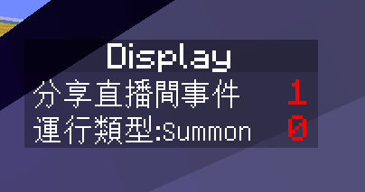
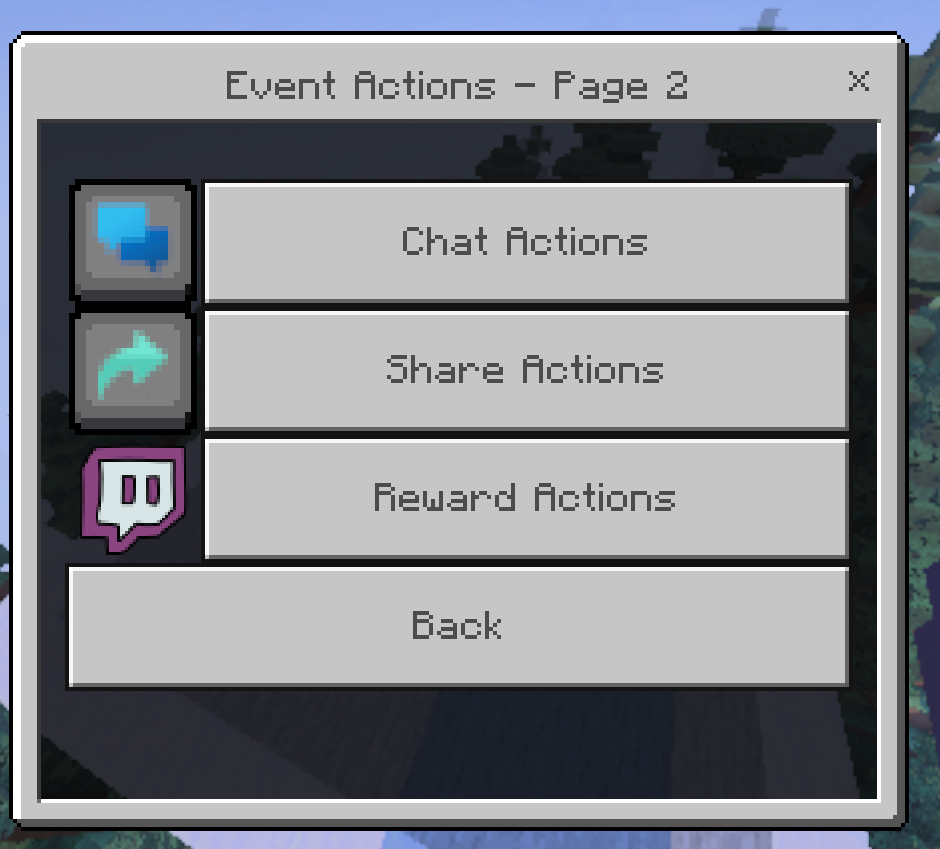

# TNTCoinImprove
這是基於Rqinix TNTCoin的改良版本
[Rqinix TNTCoin](https://github.com/rqinix/TNTCoin)

# 新增的功能

指令事件/勝利場次控制事件


Command 你可以用來運行其他的指令


Use Command ： 設定你要運行的其他Minecraft指令

Example : `say Hello322`


WinManger 你可以用來增加/減少 最大勝利場次 或 當前場次

| 值 | 說明 | 類型 |
| --- | --- | --- |
| Add Win | 增加場次或減少場次 | Number |
| Change Max | 是否修改最大值 | boolean |


StructureConfig 該選項 讓你能夠隨時調整結構的大小


| 值 | 說明 | 類型 |
| --- | --- | --- |
| Width | 結構寬度 | Number |
| Height | 結構高度 | Number |
| Max limit Width | 限制結構最大寬度 | Number |
| Max limit Height | 限制結構最大高度 | Number |

- 限制結構寬度/高度 用於控制擴建上限


| 值 | 說明 | 類型 |
| --- | --- | --- |
| Delay | 填充延遲 | Number |
| Amount | 填充數量 | Number |
| FillStop | 是否阻止運行中的填充事件 | boolean |

> 當前還未配置Delay與Amount的事件修改


| 值 | 說明 | 類型 |
| --- | --- | --- |
| range | 增加/減少寬度或高度 | Number |
| changeHeight | 是否改成修改高度 | boolean |

> 如果修改後超過最大限制寬度/高度 會以最高限制寬度/高度為最終值


### 達標提醒

如果你已成功達到設定的目標勝利場次
那麼會在顯示勝利場數的位置額外加上完成

> 你可以菜單裡設置它的狀態



### listAction 腳本事件 : 行動快速總覽

你可以直接使用 不必傳送對象值

`/scriptevent listAction`

也可以傳送要修改的 對象值
允許只修改部分 沒有填的對象值會自動補齊預設值

`/scriptevent listAction {"rdelay":60,"adelay:60","debug":false}`


| 對象 | 說明 | 類型 | 預設值 |
| --- | -- | -- | -- |
| rdealy | 起始運行等待間隔（20t = 1s) | Number | 60 |
| adealy | 下一組事件展示等待間隔（20t = 1s) | Number | 60 |
| debug | 調試用訊息 | boolean | false |




# 添加了對Twitch對接用的事件入口

這主要是對忠誠點數兌換某個指定額度觸發

本質上也能用在針對指定數量的小奇點


### importAction 腳本事件 : 根據設置好的事件配置導入

`/scriptevent importAction`

配置文件位置 `BP[iiTNTC]/scripts/game/tiktok/giftEvents.js`


# 說明

  -	此配置文件使用 JavaScript 編寫，主要用於簡化 TikTok 禮物事件的配置。
	
 -	透過 importAction 指令，系統會自動讀取該文件並導入對應的事件動作。


# giftEvents.js 配置說明

這個檔案用 **JavaScript** 編寫，用於設定 TikTok 禮物事件觸發的對應行為。

它是一個 **陣列**，每個元素都是一個事件配置對象（object）。

---

## 1 - 基本結構

```js
{
  "giftName": "禮物名稱",
  "actionType": "動作類型",
  "其他參數": "動作相關設定"
}
```


-	giftName：觸發事件的禮物名稱，例如 "Rosa" 或 "Heart Me"。

- 其值需對應 `BP[iiTNTC]/scripts/lang/tiktokGifts.js` 中存在的禮物名稱列表。
- 系統會依據這些名稱來識別不同禮物事件，請勿隨意填寫不存在的名稱。


### actionType：觸發時要執行的動作，例如：

 -	"Summon" → 生成實體（entity）
 -	"WinManger" → 改變勝利管理相關數值	
 - "RangeSet" → 修改範圍
 - "Play Sound" → 播放音效
 - "Screen Title" → 在畫面顯示文字標題
 - "Clear Blocks" → 清除方塊
 - "Fill" → 填充方塊

## 2 - 動作參數範例

### Summon

```js
{
  "actionType": "Summon",
  "entity": "tnt",
  "amount": 120,
  "location": "random",
  "onTop": true,
  "batch": [10,10],
  "sound": [true, "kururin"]
}
```

- 說明：生成 120 個 TNT，位置隨機，分兩批（10,10），同時播放 kururin 音效

### WinManger

```js
{
  "actionType": "WinManger",
  "win": 3,
  "changeMax": false
}
```

- 說明：設定勝利數值為 3，不修改最大值。


### Screen Title

```js
{
  "actionType": "Screen Title",
  "screenTitle": "Title",
  "follow": true
}
```

- 說明：在畫面上顯示標題 "Title"，條件可依據 follow、member、share、like、reward 等欄位觸發

  ### - like 與 reward 是數值觸發條件，不是布林值。

  ```js
    {
     "actionType": "Screen Title",
     "screenTitle": "Title",
     "like": 150
    }
  ```

  - 例如 like: 150 → 當該事件收到 150 個 like 時觸發。
  - 例如 reward: 100 → 當該事件收到 100 的 Twitch小奇點或忠誠點花費值達到指定值時觸發。


### Fill

 ```js
 {
  "actionType": "Fill",
  "text": "23",
  "delay": 1,
  "amount": 150
 }
```

- 說明：以每1刻 填充150個方塊的速度來進行填充
- 可以設置 delay（延遲刻數）、amount（方塊數量）

### Clear Blocks

```js
{
  "actionType": "Clear Blocks",
  "text": "22"
}
```

- 不需要也不能設置 delay 或 amount
 

## 3 - 事件分類邏輯

在 giftEvents.js 中，每個事件配置會依據以下條件欄位分類觸發

```js
{
  "text":"Ok"
}
```

| 條件欄位 | 型別 | 說明 |
| --- | -- | -- |
| like | Number | 當收到指定數量的點讚時觸發，例如 like: 150 |
| reward | Number | 當收到指定數量的小奇點或忠誠點兌換時觸發，例如 reward: 150 |
| giftName | String | 當收到指定禮物時觸發，例如 giftName: Rosa |
| text | String | 當收到特定文字指令時觸發，例如 text: "22" |
| follow | boolean | 追隨事件 固定為 true，僅作為轉譯器分類事件的標記，不作為可變條件 |
| member | boolean | 進入直播間事件 固定為 true，僅作為轉譯器分類事件的標記，不作為可變條件 |
| share | boolean | 分享直播間事件 固定為 true，僅作為轉譯器分類事件的標記，不作為可變條件 |


