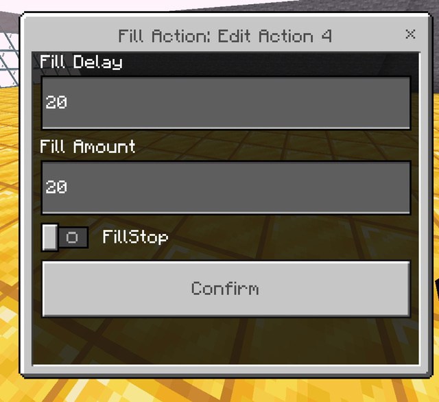

# TNTCoinImprove
這是基於Rqinix TNTCoin的改良版本
[Rqinix TNTCoin](https://github.com/rqinix/TNTCoin)

# 新增的功能

指令事件/勝利場次控制事件

Command 你可以用來運行其他的指令

Use Command ： 設定你要運行的其他Minecraft指令

Example : `say Hello322`

WinManger 你可以用來增加/減少 最大勝利場次 或 當前場次

| 值 | 說明 | 類型 |
| --- | --- | --- |
| Add Win | 增加場次或減少場次 | Number |
| Change Max | 是否修改最大值 | boolean |

StructureConfig 該選項 讓你能夠隨時調整結構的大小

| 值 | 說明 | 類型 |
| --- | --- | --- |
| Width | 結構寬度 | Number |
| Height | 結構高度 | Number |
| Max limit Width | 限制結構最大寬度 | Number |
| Max limit Height | 限制結構最大高度 | Number |

- 限制結構寬度/高度 用於控制擴建上限

| 值 | 說明 | 類型 |
| --- | --- | --- |
| Delay | 填充延遲 | Number |
| Amount | 填充數量 | Number |
| FillStop | 是否阻止運行中的填充事件 | boolean |

> 當前還未配置Delay與Amount的事件修改

| 值 | 說明 | 類型 |
| --- | --- | --- |
| range | 增加/減少寬度或高度 | Number |
| changeHeight | 是否改成修改高度 | boolean |

> 如果修改後超過最大限制寬度/高度 會以最高限制寬度/高度為最終值

### 達標提醒

如果你已成功達到設定的目標勝利場次
那麼會在顯示勝利場數的位置額外加上完成

> 你可以菜單裡設置它的狀態

### listAction 腳本事件 : 行動快速總覽

你可以直接使用 不必傳送對象值

`/scriptevent listAction`

也可以傳送要修改的 對象值
允許只修改部分 沒有填的對象值會自動補齊預設值

`/scriptevent listAction {"rdelay":60,"adelay:60","debug":false}`

| 對象 | 說明 | 類型 | 預設值 |
| --- | -- | -- | -- |
| rdealy | 起始運行等待間隔（20t = 1s) | Number | 60 |
| adealy | 下一組事件展示等待間隔（20t = 1s) | Number | 60 |
| debug | 調試用訊息 | boolean | false |
